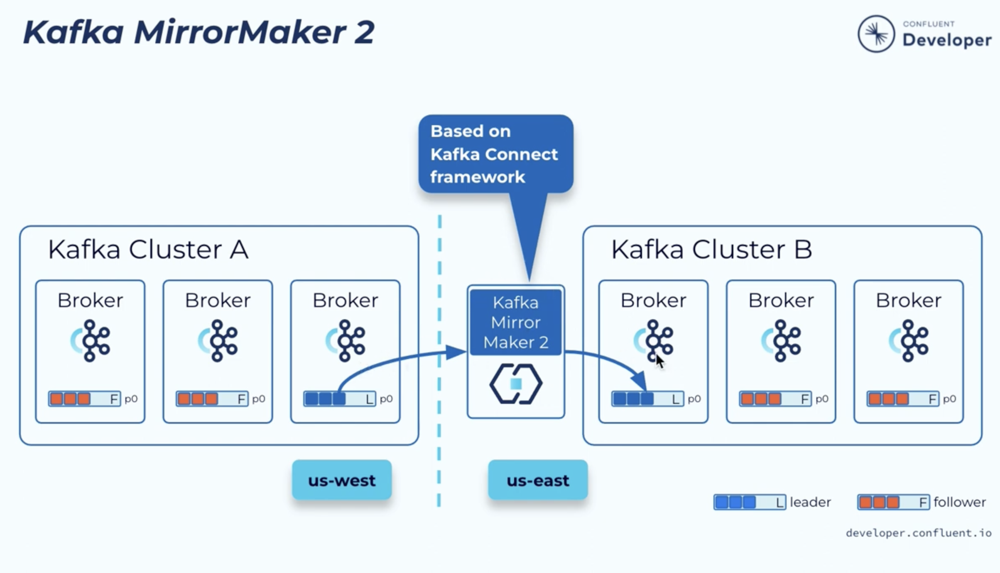

# Mirror Maker

**Kafka MirrorMaker** is an official utility used to replicate data between two or more _distinct_ Apache Kafka clusters (cross-cluster replication).

The modern version, **MirrorMaker 2 (MM2)**, is built on the Kafka Connect framework and is included in the free, open-source Apache Kafka distribution.

Here are its key features:

- **Cross-Cluster Replication:** Enables replicating topics, data, and metadata from a source cluster to a destination cluster.
- **Architecture Patterns:** Supports various topologies including Active/Passive (Disaster Recovery), Active/Active, Hub-and-Spoke, and Edge-to-Core.
- **Built on Kafka Connect:** MM2 runs as a set of Kafka Connect connectors (Source, Sink, Checkpoint, Heartbeat), providing high availability, fault tolerance, and horizontal scalability.
- **Metadata Synchronization:** Automatically synchronizes topic configurations, partition counts, and ACLs (Access Control Lists) between clusters.
- **Offset Translation:** Continuously synchronizes consumer group offsets, allowing consumers to failover to the backup cluster and resume reading from where they left off.
- **Loop Prevention:** Prevents infinite replication loops in Active/Active setups by dynamically renaming topics or using topic prefixes (e.g., `us-west.topic_name`).
- **Heartbeat Monitoring:** Emits heartbeats to monitor replication latency and ensure the connections between clusters are healthy.

In this picture, Cluster A and Cluster B are distinct cluster.

