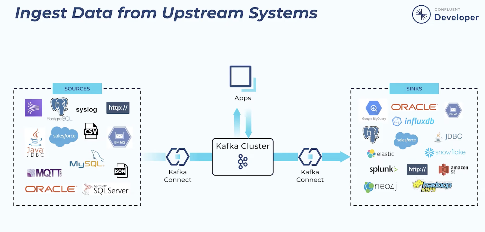

# Kafka Connect

**Kafka Connect** is a scalable and reliable framework included with Apache Kafka that simplifies the continuous streaming of data between Kafka and external systems. It utilizes ready-made, configuration-driven "connectors" to seamlessly pull data from external sources (such as databases, message queues, or APIs) into Kafka topics using Source Connectors, or to push data from Kafka topics out to external destinations (like data warehouses, search indexes, or cloud storage) using Sink Connectors.


- Install Apache Kafka on all the machines, and simply start the brokers on some servers and start Connect on other servers.

- To start connect:

```sh
connect-distributed FULL_PATH_TO_CONFIG/connect-distributed.properties
```

**We can run as many as connect instances to have a cluster of kafka connect.**

## More about some properties in `connect-distributed.properties`

- `bootstrap.servers`: A list of Kafka brokers that Connect will work with.
    - Connectors will pipe their data either to or from those brokers.
    - You don’t need to specify every broker in the cluster, but it’s recommended to specify at least three.

- `group.id`: All workers with the same group ID are part of the same Connect cluster.

- `key.converter` and `value.converter`: The two configurations set the converter for the key and value part of the message that will be stored in Kafka.
    - Default is JSON
    - We can enable schema for key and value convertor(`key.converter.schema.enable`, `value.converter.schema.enable`)
    - When schema is enabled, we can specify the schema registry URL using `key.converter.schema.registry.url` and `value.converter.schema.registry.url`
    - For Avro convertor, it is required to set schema registry if schema is enabled.

- `listeners`: To enable REST APIs. Example: `listeners=HTTP://:8083,HTTPS://myhost:8084`

## Standalone Mode

- Kafka Connect also has a standalone mode.
- It is similar to distributed mode—you just run `bin/connect-standalone.sh` instead of `bin/connect-distributed.sh`.
- You can also pass in a connector configuration file on the command line instead of through the REST API.
- In this mode, all the connectors and tasks run on the one standalone worker.
- It is usually easier to use Connect in standalone mode for development and trouble‐ shooting as well as in cases where connectors and tasks need to run on a specific machine (e.g., syslog connector listens on a port, so you need to know which machines it is running on).

## Kafka Connect Example: Part 1 File Source

- Make sure `listeners=HTTP://:8083` is set in `connect-distributed.properties` file.
- Make sure `plugin.path=` is uncommented and is pointing plugins directory.
    - For kafka installed on macos using homebrew, it is located at: `/opt/homebrew/Cellar/kafka/4.2.0/libexec/libs`.
    - If using kafka archive file, it is under `libs` directory.
- Run the connect: `connect-distributed FULL_PATH_TO_CONFIG/connect-distributed.properties`

We will load a json file into kafka topic. Now, create a file:

```sh
tee /tmp/app.log <<EOF
first line
2nd line
other line of log
EOF
```

now, make an API request to connect server and ask it to load the file:

```sh
echo '{"name":"load-app-log", "config":{"connector.class":"FileStreamSource","file":"/tmp/app.log","topic":"logs"}}' | curl -X POST -d @- http://localhost:8083/connectors -H "Content-Type:application/json"
```

You should see and output like this:

```json
{
	"name": "load-app-log",
	"config": {
		"connector.class": "FileStreamSource",
		"file": "/tmp/app.log",
		"topic": "logs",
		"name": "load-app-log"
	},
	"tasks": [],
	"type": "source"
}
```

Now, you can consume that topic to make sure there is some data:

```sh
kafka-console-consumer --bootstrap-server localhost:9092 --topic logs-topic --from-beginning
```

As soon as you add new line to the file, you should see the result in the consumer.

For example, we had this line in our log: `first line` and you should see this event in consumer:

```json
{ "schema": { "type": "string", "optional": false }, "payload": "first line" }
```

**NOTE: Each line in the file will be sent as one message to the given topic**

## Kafka Connect Example: Part 2 File Sink

```sh
echo '{"name":"dump-app-log", "config":{"connector.class":"FileStreamSink","file":"/tmp/app.log.dump","topics":"logs"}}' | curl -X POST -d @- http://localhost:8083/connectors -H "Content-Type:application/json"
```

you should see output like this:

```json
{
	"name": "dump-app-log",
	"config": {
		"connector.class": "FileStreamSink",
		"file": "/tmp/app.log.dump",
		"topics": "logs",
		"name": "dump-app-log"
	},
	"tasks": [],
	"type": "sink"
}
```

If you want to see that connector source and sink are working well, you can open 2 terminals and in the first one run

```sh
tail -f /tmp/app.log.dump
```

and in the next one:

```sh
echo 'new log1' >> /tmp/app.log
echo 'new log2' >> /tmp/app.log
echo 'new log3' >> /tmp/app.log
```

As soon as you run this command, you will see that new logs are printed in the first terminal.

## Deleting a connect config

```sh
curl -X DELETE http://localhost:8083/connectors/load-app-log
curl -X DELETE http://localhost:8083/connectors/dump-app-log
```

## Show existing connectors

```sh
curl -s http://localhost:8083/connectors | jq .
```

**KEEP IN MIND: FileStreamSource connector tracks its reading progress using a byte offset. When you truncate the file, the file’s size becomes smaller than the offset the connector has already recorded.**

## Show existing plugins

```sh
curl -X GET http://localhost:8083/connector-plugins | jq .
```

### All in commands

```sh
# setup
kafka-topics --create --bootstrap-server localhost:9092 --topic logs

echo '{"name":"load-app-log", "config":{"connector.class":"FileStreamSource","file":"/tmp/app.log","topic":"logs"}}' | curl -X POST -d @- http://localhost:8083/connectors -H "Content-Type:application/json"

echo '{"name":"dump-app-log", "config":{"connector.class":"FileStreamSink","file":"/tmp/app.log.dump","topics":"logs"}}' | curl -X POST -d @- http://localhost:8083/connectors -H "Content-Type:application/json"

# cleanup
curl -X DELETE http://localhost:8083/connectors/load-app-log
curl -X DELETE http://localhost:8083/connectors/dump-app-log
kafka-topics --delete --bootstrap-server localhost:9092 --topic logs
```

# Monitoring

**General Monitoring Tools:**

1. **JMX (Java Management Extensions):** Native to Java; you can use tools like JConsole or VisualVM to view raw metrics.
2. **UI for Apache Kafka (Provectus):** A great open-source web UI that supports monitoring Kafka clusters, including Kafka Connect clusters.

---

### How to integrate with Prometheus and Grafana

Kafka Connect exposes its metrics via JMX. To get these into Prometheus, you must use the **Prometheus JMX Exporter**, which runs as a Java agent alongside your Kafka Connect workers and translates JMX metrics into an HTTP endpoint Prometheus can scrape.

# Dead Letter Queue (DLQ)

### What is the Dead Letter Queue (DLQ) in Kafka Connect?

A Dead Letter Queue (DLQ) in Kafka Connect is a designated Kafka topic where invalid or unprocessable messages are sent instead of causing the connector task to fail and crash. Currently, the DLQ feature is specifically supported for **Sink Connectors** (which read from Kafka and write to external systems).

### Use Cases

1. **Handling "Poison Pills":** If a corrupt, malformed, or improperly serialized message enters the Kafka topic, the connector will fail to process it. Without a DLQ, this single bad message halts the entire pipeline. The DLQ isolates the bad message so the connector can continue processing healthy data.
2. **Troubleshooting and Auditing:** Engineers can monitor the DLQ topic to investigate why messages failed, fix the upstream data producers, or manually reprocess the corrected data later.

### How to Configure it

To enable the DLQ, you need to change the error tolerance settings and specify the target DLQ topic in your Sink Connector's configuration.

Here are the key properties to add to your connector config:

```json
{
	"name": "my-sink-connector",
	"config": {
		"...": "...",

		"errors.tolerance": "all",
		"errors.deadletterqueue.topic.name": "my-connector-dlq",
		"errors.deadletterqueue.context.headers.enable": "true",
		"errors.log.enable": "true",
		"errors.log.include.messages": "true"
	}
}
```

**Configuration Breakdown:**

- **`errors.tolerance: "all"`**: Tells the connector to skip problematic records and continue processing. (The default is `"none"`, which causes the task to fail immediately on an error).
- **`errors.deadletterqueue.topic.name`**: The name of the Kafka topic where failed records will be routed. (Make sure this topic exists or auto-creation is enabled).
- **`errors.deadletterqueue.context.headers.enable: "true"`**: Highly recommended. It appends headers to the DLQ message containing the reason for the failure (e.g., exception stack trace, original topic, partition, and offset), making debugging much easier.
- **`errors.log.enable` & `errors.log.include.messages`**: Optional but helpful for printing the errors and the problematic message content directly to the Kafka Connect worker logs.
