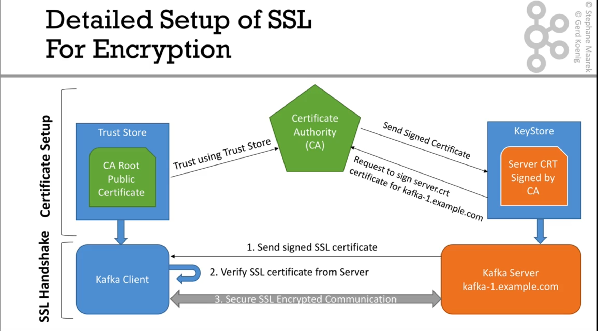

# رمزنگاری - Encryption

- رمزنگاری در کافکا، این اطمینان را میدهد که داده بین کلاینت و broker به صورت ایمن منتقل میشود و از دید روتر های مسیر و سایر افراد در این شبکه مخفی است.
  

در ادامه، ابتدا به ساخت یک Certificate Authority (CA) خواهیم پرداخت.

## راه اندازی CA

**درصورتیکه از یک CA معتبر یا CA در شبکه استفاده میکنید، میتوانید این مرحله را عبور کنید.**

```sh
mkdir ssl
cd ssl

openssl req -new -newkey rsa:4096 -days 365 -x509 -subj "/CN=Kafka-Security-CA" -keyout ca-key -out ca-cert -noenc
```

توضیحات:

سوییچ = flag

- سوییچ `-new`: ایجاد کلید جدید
- سوییچ `-newkey rsa:4096`: ایجاد کلید RSA با طول ۴۰۹۶ بیت
- سوییچ `-days 365`: مدت زمان اعتبار ۳۶۵ روز
- سوییچ `-x509`: جهت امضا کردن گواهینامه (self signed certificate)
- سوییچ `-subj "/CN=Kafka-Security-CA"`: اضافه کردن اطلاعات شناسایی یه گواهینامه. در این دستور مقدار CN یا همان Common Name به مقدار Kafka-Security-CA تنظیم شده است.
- سوییچ `-keyout ca-key`: خروجی دادن کلید خصوصی در فایلی به نام ca-key
- سوییچ `-out ca-cert`: خروجی دادن گواهینامه عمومی در فایلی به نام ca-cert
- سوییچ `-noenc`: به این معنی است که کلید خصوصی را رمزنگاری نکن. در نسخه های قدیمی تر این سوییچ با -nodes اعمال میشد.

## تنظیمات SSL در کافکا

### تنظیمات Keystore

مرحله اول: ساخت key pair و keystore

```sh
export SRVPASS=STRONG_SECRET

cd ssl # ssl directory created in CA setup.

keytool -genkeypair -keystore kafka.server.keystore.jks -keyalg RSA -keysize 2048 -alias kafka-broker -validity 365 -storepass $SRVPASS -keypass $SRVPASS -dname "CN=localhost" -storetype pkcs12
```

نکته: در سوییچ dname مقدار تنظیم شده برای CN باید نام هاست یا IP مربوط به broker کافکا باشد.
درصورتیکه این مقدار مانند این مثال، به localhost تنظیم شود، هیچ client بیرون از محیط local قادر به اتصال به این بروکر نخواهد بود.

جهت مشاهده محتوای کلید تولید شده را مشاهده کنیم از دستور زیر استفاده میکنیم:

```sh
keytool -list -v -keystore kafka.server.keystore.jks
```

مرحله دوم: ایجاد درخواست گواهینامه یا CSR (Certificate Signing Request)

```sh
export SRVPASS=STRONG_SECRET
cd ssl # ssl directory created in CA setup.

## مرحله اول: دریافت فایل درخواست امضای گواهینامه - Sign request
keytool -keystore kafka.server.keystore.jks -certreq -alias kafka-broker -file cert-file -storepass $SRVPASS -keypass $SRVPASS
```

نکته: مقدار تنظیم شده برای سوییچ alias باید همانند مقداری باشد که زمان ساخت keystore استفاده شده است.

مرحله سوم: امضای CSR در CA

درصورتیکه از یک CA معتبر یا CA شبکه بخواهیم گواهینامه دریافت کنیم، این فایل را برای آنها ارسال میکنیم و آنها یک گواهینامه برای ما تولید میکنند.
حال اگر بخواهیم خودمان به صورت self signed این گواهینامه را تولید کنیم، مرحله بعد را نیز انجام میدهیم:

```sh
export SRVPASS=STRONG_SECRET
cd ssl # ssl directory created in CA setup.

openssl x509 -req -CA ca-cert -CAkey ca-key -in cert-file -out cert-signed -days 365 -CAcreateserial -passin pass:$SRVPASS
```

جهت مشاهده جزییات گواهینامه از دستور زیر استفاده میشود:

```sh
keytool -printcert -v -file cert-signed
```

### تنظیمات Truststore

مرحله اول: ایجاد کلید برای truststore:

```sh
keytool -importcert -keystore kafka.server.truststore.jks -alias CARoot -file ca-cert -storepass $SRVPASS -keypass $SRVPASS -noprompt
```

این دستور به این معناست که ما یک keystrore ایجاد میکنیم که گواهینامه عمومی CA را در آن import میکنیم.

مرحله دوم: در این مرحله میبایست گواهینامه عمومی تولید شده توسط CA را به keystore ایمپورت کنیم.

```sh
keytool -importcert -keystore kafka.server.keystore.jks -alias CARoot -file ca-cert -storepass $SRVPASS -keypass $SRVPASS -noprompt
```

مرحله نهایی: در این مرحله نیز باید کلید امضا شده ای که در مرحله سوم تنظیمات keystore تولید کرده ایم را به keystore ایمپورت کنیم.

```sh
keytool -importcert -keystore kafka.server.keystore.jks -alias kafka-broker -file cert-signed -storepass $SRVPASS -keypass $SRVPASS -noprompt
```

---

تمامی دستورات این بخش به صورت یکجا:

```sh
mkdir ssl
cd ssl


# CA
openssl req -new -newkey rsa:4096 -days 365 -x509 -subj "/CN=Kafka-Security-CA" -keyout ca-key -out ca-cert -noenc


# keystore
export SRVPASS=STRONG_SECRET

keytool -genkeypair -keystore kafka.server.keystore.jks -keyalg RSA -keysize 2048 -alias kafka-broker -validity 365 -storepass $SRVPASS -keypass $SRVPASS -dname "CN=localhost" -storetype pkcs12

keytool -keystore kafka.server.keystore.jks -certreq -alias kafka-broker -file cert-file -storepass $SRVPASS -keypass $SRVPASS

openssl x509 -req -CA ca-cert -CAkey ca-key -in cert-file -out cert-signed -days 365 -CAcreateserial -passin pass:$SRVPASS

# Truststore
keytool -importcert -keystore kafka.server.truststore.jks -alias CARoot -file ca-cert -storepass $SRVPASS -keypass $SRVPASS -noprompt

keytool -importcert -keystore kafka.server.keystore.jks -alias CARoot -file ca-cert -storepass $SRVPASS -keypass $SRVPASS -noprompt

keytool -importcert -keystore kafka.server.keystore.jks -alias kafka-broker -file cert-signed -storepass $SRVPASS -keypass $SRVPASS -noprompt
```

---

### تنظیمات سرور کافکا

برای فعال سازی رمزنگاری ارتباط، تغییرات زیر را در فایل server.propertis و broker.properties اعمال کنید:

```
listeners=SSL://0.0.0.0:29092 # ادرس را میتوان مطابق نیاز تغییر داد.
advertised.listeners=SSL://localhost:29092 # این مقدار میتواند معادل آدرس هاست دی ان اس این سرور باشد

ssl.keystore.location=/full/path/to/keystore.jks
ssl.keystore.password=KEYSTORE_PASS
ssl.key.password=SSL_PASSWORD
ssl.truststore.location=/full/path/to/truststore.jks
ssl.truststore.password=TRUST_PASS

```

پس از اعمال تغییرات، سرویس کافکا را ری استارت کنید. در صورتیکه با موفقیت ری استارت شد، با دستور زیر میتوانید مطمئن شوید که کافکا در پورت تعیین شده در حال گوش دادن به درخواست هست:

```sh
openssl s_client -connect localhost:29092
```

---

Kafka security protocols:

- PLAINTEXT: not secure
- SASL_PLAINTEXT: not secure
- SSL: secure
- SASL_SSL: secure

SASL = Simple Authentication Security Layer

Different protocols can be applied to different connection protocols.

We have 2 types of connections:

- Client - Broker
- Broker - Broker

Kafka supports 4 different authentication mechanism:

- GSSAPI: Kerberos (active directory, open LDAP)
- Plain: (username/password)
- SCAM-SHA: (username/password)
- OAUTHBEARER: Machine to machine Single Sign On

Kafka also support ACL (Access Control List) to allow users to perform specific tasks when Authenticated on Kafka.

ACLs describe which user is permitted to perform certain operation on specific resources.

ACL binding: Principal + Permission Type + Operation + Resource
Example: [User:Bob] has [Allow] permission for [Write] operation to [Topic:customers].

NOTES: Principal should be in this format: User:Username or User:\* for all users.

## Defining ACLs

Here is a simple example of how can define an ACL:

```sh
kafka-acls --bootstrap-server localhost:9092 --add --allow-principal User:Bob --allow-principal User:John --operation read --operation write --topic finance
```

# Setting up SSL Encryption

# General Security recommendations

- Using full dist encryption or volume encryption is highly recommended for secure data store.
-
