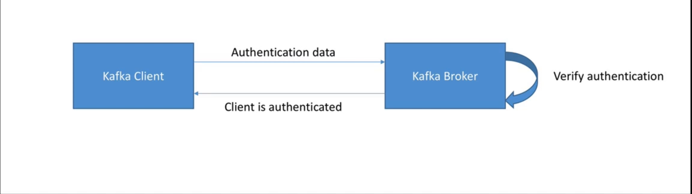

# احراز هویت - Authentication

- احرازهویت در کافکا این اطمینان را میدهد که کلاینت هایی میتوانند با کافکا ارتباط بگیرند که بتوانند ثابت کنند که هویت آنها برای کافکا مورد تایید است. این موضوع مشابه استفاده از نام کاربری و رمز عبور در زمان ورود به یک وب سایت است.

## روش های مختلف احراز هویت

- احراز هویت SSL: کلاینت ها با استفاده از یک گواهینامه SSL در کافکا احرازهویت میشود.
- احراز هویت SASL(Simple Authentication Security Layer):
    - روش PLAIN: کلاینت با استفاده از یک نام کاربری و رمز عبور احراز هویت میکند. (ضعیف - تنظیمات آسان)
    - روش Kerberos: مانند استفاده از Microsoft Active Directory (قوی - تنظیمات دشوار)
    - روش SCRAM: نام کاربری و رمز عبور (قوی - تنظیمات نسبتا دشوار)
