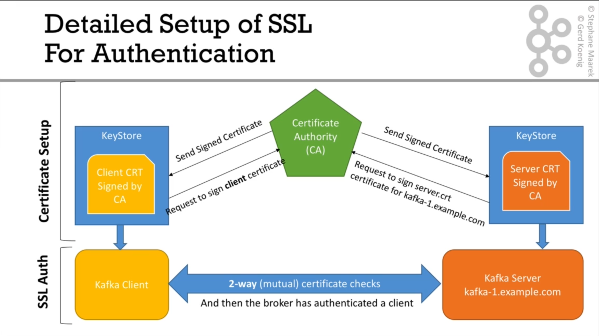

# احراز هویت با استفاده از گواهینامه SSL

کلاینت با استفاده از یک گواهینامه SSL در کافکا احرازهویت میشود و درصورتیکه گواهینامه معتبری ارائه دهد، میتواند با سرور ارتباط بگیرد.



نکته: در صورتیکه پیش از این، بخش رمزنگاری ارتباط را مطالعه نکرده اید، لطفا ابتدا [این بخش](./61-security-encryption.md) را مطالعه کنید.

---

مقایسه رمزنگاری با ssl و احرازهویت با ssl:

در رمزنگاری:

- تنها سرور گواهینامه امضا شده دارد.
- کلاینت با استفاده از اعتبار سنجی گواهینامه سرور، با سرور ارتباط میگرید.
- کلاینت هیچ هویتی برای سرور ندارد.

در احراز هویت با ssl:

- کلاینت و بروکر هردو گواهینامه امضا شده دارند.
- کلاینت و بروکر هردو گواهینامه ی یکدیگر را اعتبار سنجی میکنند.
- گواهینامه کلاینت،‌ به عنوان هویت کلاینت عمل میکند و سرور با استفاده از این گواهینامه میداند که چه کلاینتی با چه هویتی به او متصل شده است.

مراحل انجام کار برای فعال سازی احرازهویت با گواهینامه شامل موارد زیر است:

- ساخت keystore برای کلاینت
- تنظیمات بروکر کافکا جهت الزام به احرازهویت با گواهینامه
- تست عملکرد

## ساخت keystore برای کلاینت

### مرحله اول: ساخت keystore (اجرا در کلاینت)

```sh
mkdir -p ~/Desktop/workspace/kafka/secrets/client
cd ~/Desktop/workspace/kafka/secrets/client

export CLIENT_PASS=clinetOLPrcS2pLLeN8WJmr1EVmEFCc

keytool -genkeypair -keystore kafka.client.keystore.jks -keyalg RSA -keysize 2048 -alias price-feed-client -validity 3650 -storepass $CLIENT_PASS -keypass $CLIENT_PASS -storetype pkcs12 -dname "CN=price-updater-client"
```

نکته: مقدار CN همان هویت این کلاینت خواهد بود. چیزی شبه به نام کاربری کاربر.

### مرحله دوم: ساخت CSR جهت ارسال به CA (اجرا در کلاینت)

```sh
keytool -keystore kafka.client.keystore.jks -certreq -alias price-feed-client -file client-cert-sign-request -storepass $CLIENT_PASS -keypass $CLIENT_PASS
```

فایل تولید شده در این مرحله،‌ میبایست به CA ارسال شود که در نهایت CA گواهینامه امضا شده نهایی را به ما برگرداند.

### مرحله سوم: (اجرا در CA)

این مرحله، در حقیقت در CA انجام میشود و درصورتیکه در دسترس خودتان است، انجام دهید.

با فرض بر اینکه شما مطابق این آموزش، پیش رفته اید، فایل های CA در پوشه ای مجاور همین پوشه قرار دارد.

```sh
cp ~/Desktop/workspace/kafka/secrets/client/client-cert-sign-request ~/Desktop/workspace/kafka/secrets/ca
cd ~/Desktop/workspace/kafka/secrets/ca


CA_PASSWORD=caRstSWx9LvFSs3cjnBVkk1UhMyQQ
#و برای امضای گواهینامه
openssl x509 -req -CA ca-cert -CAkey ca-key -in client-cert-sign-request -out client-cert-signed -days 3650 -CAcreateserial -passin pass:$CA_PASSWORD
```

توجه: زمانیکه شما از CA شبکه استفاده میکنید فایل client-cert-signed توسط آنها برای شما ارسال خواهد شد.

### مرحله چهارم: (اجرا در کلاینت)

باید کلید عمومی CA در keystore اضافه شود:

```sh
cp ~/Desktop/workspace/kafka/secrets/ca/ca-cert ~/Desktop/workspace/kafka/secrets/client
cd ~/Desktop/workspace/kafka/secrets/client

keytool -importcert -keystore kafka.client.keystore.jks -alias CARoot -file ca-cert -storepass $CLIENT_PASS -keypass $CLIENT_PASS -noprompt
```

### مرحله پنجم: (اجرا در کلاینت)

گواهینامه امضا شده در مرحله سوم نیز باید به keystore اضافه شود.

```sh
cp ~/Desktop/workspace/kafka/secrets/ca/client-cert-signed ~/Desktop/workspace/kafka/secrets/client

keytool -importcert -keystore kafka.client.keystore.jks -alias price-feed-client -file client-cert-signed -storepass $CLIENT_PASS -keypass $CLIENT_PASS -noprompt
```

دقت کنید که alias در این مرحله باید مطابق مقدار تنظیم شده در مرحله ۲ باشد.

### مرحله ششم: تنظیم سرور کافکا (اجرا در سرور کافکا)

در سرور کافکا فایل server.properties را باز کنید و تنظیم زیر را اضافه کنید.

دقت کنید که فرض بر این است که شما در مرحله تنظیمات رمزنگاری، قبلا، keystore و truststore را انجام داده اید.

```conf
ssl.client.auth=required
```

سپس سرویس کافکا را ری استارت نمایید.

### مرحله هفتم: تنظیمات کلاینت (اجرا در کلاینت)

در این مرحله تنظیمات لازم برای ارتباط کلاینت به سرور به کمک احرازهویت با گواهینامه انجام میشود:

```sh
tee client.auth.properties <<EOF
security.protocol=SSL
ssl.truststore.location=/Users/sam/Desktop/workspace/kafka/secrets/client/kafka.client.truststore.jks
ssl.truststore.password=clinetOLPrcS2pLLeN8WJmr1EVmEFCc

ssl.keystore.location=/Users/sam/Desktop/workspace/kafka/secrets/client/kafka.client.keystore.jks
ssl.keystore.password=clinetOLPrcS2pLLeN8WJmr1EVmEFCc
ssl.key.password=clinetOLPrcS2pLLeN8WJmr1EVmEFCc
EOF
```

### مرحله هشتم: تست عملکرد

برای تست عملکرد، ۲ ترمینال مجزا باز کنید و در یکی دستور consumer و در دیگری دستور مربوط به producer را اجرا کنید

```sh
# consumer
kafka-console-consumer --bootstrap-server localhost:9092 --topic some-topic --from-beginning --command-config ./client.auth.properties
```

```sh
# producer
kafka-console-producer --bootstrap-server localhost:9092 --topic some-topic --command-config ./client.auth.properties
```

### تنظیمات در سرور اوبونتو

درصورتیکه مطابق آموزش [نصب و راه اندازی در سرور اوبونتو](./02-installation.md#linux-ubuntudebian) پیش رفته اید، میتوانید به کمک [این اسکریپت](./kafka-ubuntu-ssl.sh)، مطابق مراحل فوق، گواهینامه ها را ایجاد کنید.

```sh
chmod +x kafka-ubuntu-ssl.sh
./kafka-ubuntu-ssl.sh
```
