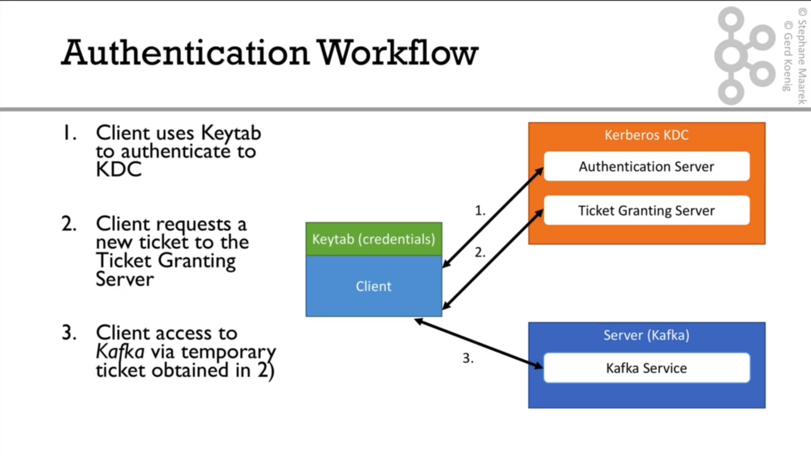

# احراز هویت با استفاده از GSSAPI/Kerberos

تعریف kerberos: یک پرتکل برای احرازهویت در یک شبکه است.

در kerberos انتقال داده کاملا رمزنگاری شده است حتی اگر ارتباطات شبکه رمزنگاری نباشد.

## مهفوم KDC

در پروتکل کربروس (Kerberos)، **KDC** مخفف **Key Distribution Center** (مرکز توزیع کلید) است. این بخش، سرور امنیتی مرکزی و قابل اعتمادی است که وظیفه احراز هویت کاربران و سرویس‌ها را در شبکه بر عهده دارد.

وظیفه اصلی KDC این است که هویت‌ها را به صورت امن بررسی کرده و «بلیت‌هایی» (Tickets) صادر کند تا کاربران بتوانند بدون نیاز به ارسال رمز عبور خود در بستر شبکه، به منابع مختلف دسترسی پیدا کنند.

این مرکز از دو بخش منطقی اصلی تشکیل شده است:

۱. **سرور احراز هویت (Authentication Server - AS):** ورود اولیه کاربر را تأیید کرده و یک بلیت اصلی و موقت به نام TGT (مخفف Ticket Granting Ticket یا بلیتِ اعطای بلیت) صادر می‌کند.
۲. **سرور اعطای بلیت (Ticket Granting Server - TGS):** بلیت TGT را بررسی و تأیید می‌کند و سپس «بلیت‌های سرویس» (Service Tickets) خاصی را صادر می‌کند. این بلیت‌های سرویس به کاربر اجازه می‌دهند تا به سرویس‌های مشخصی در شبکه (مثل یک فایل‌سرور یا پایگاه داده) دسترسی داشته باشد.

در محیط‌های ویندوز اکتیو دایرکتوری (Active Directory)، سرویس KDC روی تمامی دامین کنترلرها (Domain Controllers) اجرا می‌شود.



**هیچگاه سرویس kerberos را در همان سروری که سرویس کافکا وجود دارد نصب. و راه اندازی نکنید.**

در نظر داشته باشید که هدف این آموزش، راه اندازی کافکا و استفاده از کربروس برای احرازهویت است. پس در بخش مرتبط به نصب و راه اندازی کربروس، چندان وارد جزییات خواهیم شد چون از خارج از هدف اصلی این آموزش است.

---

**نکته: در این آموزش، به علت محدودیت هایی در دی ان اس سرور، بجای آدرس FQDN سرورها، از آدرس آی پی آنها استفاده میشود. ولی برای محیط پروداکشن توصیه میشود که از FQDN سرور ها استفاده کنید.**

---

در این آموزش، سرور کربروس در آدرس ۱۹۲.۱۶۸.۱۵۰.۱۰۲ و کافکا در آدرس ۱۹۲.۱۶۸.۱۵۰.۱۰۰ راه اندازی خواهند شد.

## نصب سرور کربروس

در این آموزش نصب کربروس در توزیع ubuntu server انجام خواهد شد. سایر توزیع ها ممکن است تفاوت های جزیی داشته باشند.

```sh
sudo hostnamectl set-hostname kdc.tibobit.com
sudo reboot
```

پس از روشن شدن مجدد سرور با دستورات زیر ادامه بدهید:

```sh
sudo vi /etc/hosts
```

سپس در این فایل خط زیر را اضافه کنید:

```sh
YOUR_IP kdc.tibobit.com
```

و بجای YOUR_IP، آدرس آی پی سرور را بگذارید.

---

از آنجایی که سرور کربروس به زمان بسیار حساس است مطمئن باشید که NTP سرور فعال است.

```sh
sudo timedatectl set-ntp true

timedatectl status # you should see NTP service: active
```

---

سپس پکیج های مورد نیاز را نصب کنید:

```sh
sudo apt update
sudo apt install -y krb5-kdc krb5-admin-server krb5-config
```

سپس در حین نصب، چند سوال پرسیده خواهد شد که به این گونه پاسخ را وارد کنید:

Default Kerberos version 5 realm: Enter TIBOBIT.COM (حتما با حروف بزرگ وارد شود)

Kerberos servers for realm: Enter 192.168.150.102

Administrative server: Enter 192.168.150.102

در صورتیکه هرزمان نیاز به تغییر این سه مقدار داشته باشید میتوانید با این دستورات آنها را مجدد تنظیم کنید:

```sh
sudo dpkg-reconfigure krb5-config
sudo dpkg-reconfigure krb5-kdc
```

فایل های مربوط به تنظیمات kerberos و kdc در مسیر های زیر قابل مشاهده اند:

```sh
cat /etc/krb5.conf

cat /etc/krb5kdc/kdc.conf
```

---

فایل /etc/krb5kdc/kdc.conf را به وسیله یک ویرایشگر باز کرده و در زیر بخش [kdcdefaults] مطمعن شوید که این خط default_realm = TIBOBIT.COM وجود دارد و یا اضافه کنید.

در نهایت ابتدای این فایل چیزی مشابه این خواهد بود:

```conf
[kdcdefaults]
    kdc_ports = 750,88
    default_realm = TIBOBIT.COM
```

در همین فایل، اگه تنظیم acl_file را در زیرگروه [realms] مشاهده کنید، آدرس فایلی است که در مرحله بعد نیاز داریم. در این آموزش، این فایل در آدرس زیر است:

```
/etc/krb5kdc/kadm5.acl
```

به کمک یک ویرایشگر باز کنید تمامی محتوای موجود را پاک کرده و مقدار زیر را اضافه کنید:

```sh
sudo echo "*/admin@TIBOBIT.COM *" > /etc/krb5kdc/kadm5.acl
```

---

حال فایل /etc/krb5.conf را به صورت زیر ویرایش کنید:

```sh
sudo tee /etc/krb5.conf <<EOF
[libdefaults]
	default_realm = TIBOBIT.COM
	ticket_lifetime = 24h
	kdc_timesync = 1

[realms]
	TIBOBIT.COM = {
        # we can use FQDN here
		kdc = 192.168.150.102
		admin_server = 192.168.150.102
	}
EOF
```

---

در مرحله بعد، میبایست دیتابیس principal را ایجاد کنیم:

```sh
sudo kdb5_util create -s -r TIBOBIT.COM
```

سپس از شما رمزی برای دیتابیس پرسیده میشود که مقداری ایمن تنظیم کنید و همیشه آن را به خاطر داشته باشید.

---

مرحله آخر ساخت admin principal است.

```sh
sudo kadmin.local
```

با این دستور وارد ترمینال مدیریت کربروس می شوید که میتوانید دستور زیر را اجرا کنید.

```sh
add_principal admin/admin
```

و پس از اجرا از شما پسوردی میخواهد که برای این پرینسیپال تنظیم کنید.

برای خروج از ترمینال مدیریت، دستور quit را اجرا کنید یا ctrl+d بزنید.

این دستور را میتوانید به این صورت نیز در یک خط اجرا کنید:

```sh
sudo kadmin.local -q "add_principal -pw YOUR_SECURE_PASSWORD admin/admin"
```

---

حال می بایست سرویس های متناظر کربروس را مجدد راه اندازی کرد.

```sh
sudo systemctl restart krb5-kdc.service
sudo systemctl restart krb5-admin-server.service
```

و سپس مطمئن شوید که سرویس به درستی در حال اجراست:

```sh
sudo systemctl status krb5-kdc.service
sudo systemctl status krb5-admin-server.service
```

نصب و تنظیمات سرور کربروس با موفقیت به انجام رسیده است.

## تنظیمات محیط کربروس

در این مرحله به تنظیمات محیط کربروس شامل principals و keytabs خواهیم پرداخت.

ابتدا چند پرینسیپال جدید اضافه کنید. این موارد برای استفاده در کلاینت مد نظر است.

```sh
sudo kadmin.local -q "add_principal -randkey reader@TIBOBIT.COM"
sudo kadmin.local -q "add_principal -randkey writer@TIBOBIT.COM"
sudo kadmin.local -q "add_principal -randkey admin@TIBOBIT.COM"
```

- سوییچ randkey به معنی کلید رندم برای پسورد است.

در مرحله بعدی، یک پرینسیپال برای سرور کافکا ایجاد میکنیم. این پرینسیپال در سرور کافکا جهت شناسه در کربروس ایجاد میشود.

```sh
sudo kadmin.local -q "add_principal -randkey kafka/192.168.150.100@TIBOBIT.COM"
```

دقت کنید که مقدار 192.168.150.100 را با مقدار واقعی در شبکه خود جایگزین کنید.
این مقدار میتواند آدرس آی پی یا آدرس دی ان اس یه FQDN سرور در شبکه باشد.

---

**سوال: تفاوت admin@TIBOBIT.COM و kafka/192.168.150.100@TIBOBIT.COM در چیست؟**

تفاوت این دو در نوع Principal (شناسه‌ کاربری/سرویس) و کاربرد آن‌هاست. فرمت استاندارد یک Principal در کربروس به شکل **`primary/instance@REALM`** است.

**۱. دستور `add_principal admin@TIBOBIT.COM`**

- **نوع:** User Principal (شناسه کاربری یا کلاینت)
- **ساختار:** فقط شامل بخش `primary` (یعنی `admin`) و `REALM` است. در اینجا بخش `instance` وجود ندارد.
- **کاربرد:** این حالت معمولاً برای یک کاربر انسانی یا یک کلاینت عمومی استفاده می‌شود تا در KDC احراز هویت کند. هنگام ورود، کاربر `admin` رمز عبور خود را وارد می‌کند تا یک تیکت اولیه (TGT) دریافت کند.

**۲. دستور `add_principal kafka/192.168.150.100@TIBOBIT.COM`**

- **نوع:** Service Principal (شناسه سرویس)
- **ساختار:** شامل هر دو بخش `primary` (یعنی `kafka`) و `instance` (یعنی `192.168.150.100`) است.
- **کاربرد:** از این ساختار برای معرفی یک سرویس مشخص که روی یک ماشین/سرور مشخص اجرا می‌شود، استفاده می‌گردد.
    - بخش **`kafka`** نوع سرویسِ در حال اجرا را مشخص می‌کند.
    - بخش **`192.168.150.100`** دقیقاً مشخص می‌کند که این سرویس روی کدام سرور (هاست) قرار دارد. _(نکته: با وجود اینکه می‌توان از IP استفاده کرد، در کربروس به شدت توصیه می‌شود که برای بخش instance به جای آدرس IP از نام کامل دامنه (FQDN) استفاده کنید، مانند: `kafka/host1.tibobit.com@TIBOBIT.COM`)._
- **نحوه استفاده:** برای این نوع شناسه، یک انسان رمز عبور وارد نمی‌کند؛ بلکه کلید (Key) این شناسه استخراج شده و در فایلی به نام `keytab` روی سرور ذخیره می‌شود (جهت احراز هویت خودکار). کلاینت‌هایی که می‌خواهند با سرویس کافکا در آن سرور ارتباط برقرار کنند، از KDC یک تیکت مخصوص برای همین Service Principal درخواست می‌کنند.

---

مرحله بعد، اکسپورت کردن پرینسیپال هایی است که ساخته ایم به keytab فایل های متناظر است.

```sh
sudo kadmin.local -q "xst -kt /tmp/reader.user.keytab reader@TIBOBIT.COM"
sudo kadmin.local -q "xst -kt /tmp/writer.user.keytab writer@TIBOBIT.COM"
sudo kadmin.local -q "xst -kt /tmp/admin.user.keytab admin@TIBOBIT.COM"
sudo kadmin.local -q "xst -kt /tmp/kafka.service.keytab kafka/192.168.150.100@TIBOBIT.COM"

chmod a+r /tmp/*.keytab
```

**اخطار: فایل های کی تب که در این مرحله ساخته میشود، فقط و فقط باید هر فایل در اختیار کلاینت یا سرویسی باشد که قرار است از آن استفاده کند. از انتشار عمومی آن جدا خودداری کنید.**

فایل های ساخته شده در این مرحله را از سرور کپی کنید و در اختیار مصرف کننده قرار دهید.

---

## تنظیمات سرور کافکا بخش اول

**توجه داشته باشید که این قسمت فرض بر این است که شما قبلا مطابق آموزش [نصب در اوبونتو](./02-installation.md#linux-ubuntudebian) پیش رفته اید.**

در این مرحله، فایل ساخته شده برای سرویس کافکا را از سرور دانلود و به سرور کافکا منتقل میکنیم.

```sh
sudo mkdir -p /var/kafka/keytabs
sudo mv kafka.service.keytab /var/kafka/keytabs
sudo chown -R kafka:kafka /var/kafka/keytabs
```

حال میبایست وارد سرور کافکا شده و مراحل زیر را ادامه دهیم.

```sh
export DEBIAN_FRONTEND=noninteractive && sudo apt install -y krb5-user
```

و درصورتیکه این سه سوال پرسیده شود، مطابق زیر پاسخ دهید

Default Kerberos version 5 realm: Enter TIBOBIT.COM (حتما با حروف بزرگ وارد شود)

Kerberos servers for realm: Enter 192.168.150.102

Administrative server: Enter 192.168.150.102

حال فایل /etc/krb5.conf را به صورت زیر ویرایش کنید:

```sh
sudo tee /etc/krb5.conf <<EOF
[libdefaults]
	default_realm = TIBOBIT.COM
	ticket_lifetime = 24h
	kdc_timesync = 1

[realms]
	TIBOBIT.COM = {
        # we can use FQDN here
		kdc = 192.168.150.102
		admin_server = 192.168.150.102
	}
EOF

```

### تست عملکرد

برای اطمینان از اینکه میتوانید از سرور کافکا، به سرور کربروس ارتباط بگیرید و تیکت دریافت کنید، از دستور زیر استفاده کنید:

```sh
sudo kinit -kt /var/kafka/keytabs/kafka.service.keytab kafka/192.168.150.100
```

حال برای مشاهده تیکت ایجاد شده:

```sh
sudo klist
```

خروجی دستور klist چیزی مشابه این خواهد بود:

```
Ticket cache: FILE:/tmp/krb5cc_0
Default principal: kafka/192.168.150.100@TIBOBIT.COM

Valid starting       Expires              Service principal
05/04/2026 21:40:49  05/05/2026 07:40:49  krbtgt/TIBOBIT.COM@TIBOBIT.COM
	renew until 05/05/2026 21:40:38
```

## تنظیمات سرور کافکا بخش دوم

در این بخش به تنظیمات خود سرویس کافکا خواهیم پرداخت.

برای این کار، ابتدا تنظیمات ssl را از بخش [رمزنگاری](./61-security-encryption.md) از مرحله اول تا پایان مرحله هشتم انجام داده. سپس مراحل زیر را ادامه دهید.

**در این آموزش فرض بر این است که تنها یک سرویس کافکا به عنوان کنترولر و بروکر در حال اجرا است. در صورت کلاستر سازی، ممکن است برخی مقادیر متفاوت باشد.**

فایل /opt/kafka/config/server.properties را باز کرده و مقادیر زیر را بروزرسانی کنید:

```conf
listeners=EXTERNAL://:9092,CONTROLLER://:9093
inter.broker.listener.name=EXTERNAL
advertised.listeners=EXTERNAL://192.168.150.100:9092,CONTROLLER://localhost:9093
listener.security.protocol.map=EXTERNAL:SASL_SSL,CONTROLLER:SASL_SSL,PLAINTEXT:PLAINTEXT,SSL:SSL,SASL_PLAINTEXT:SASL_PLAINTEXT,SASL_SSL:SASL_SSL

ssl.keystore.location=/var/kafka/secrets/server/kafka.server.keystore.jks
ssl.keystore.password=keystoreTKtPspFDZ2CYz3EluZMha24Drp
ssl.key.password=keystoreTKtPspFDZ2CYz3EluZMha24Drp
ssl.truststore.location=/var/kafka/secrets/server/kafka.server.truststore.jks
ssl.truststore.password=truststroreXa6DlDATAOHLTaIOcbRGZdpEYOx0

sasl.enabled.mechanisms=GSSAPI
sasl.kerberos.service.name=kafka
# Ensure Kafka knows which SASL mechanisms these internal protocols should use
sasl.mechanism.inter.broker.protocol=GSSAPI
sasl.mechanism.controller.protocol=GSSAPI
```

```sh
tee /opt/kafka/config/kafka_server_jaas.conf <<EOF
external.KafkaServer {
    com.sun.security.auth.module.Krb5LoginModule required
    useKeyTab=true
    storeKey=true
    keyTab="/var/kafka/keytabs/kafka.service.keytab"
    principal="kafka/192.168.150.100@TIBOBIT.COM";
};

controller.KafkaServer {
    com.sun.security.auth.module.Krb5LoginModule required
    useKeyTab=true
    storeKey=true
    keyTab="/var/kafka/keytabs/kafka.service.keytab"
    principal="kafka/192.168.150.100@TIBOBIT.COM";
};
EOF

sudo chown kafka:kafka /opt/kafka/config/kafka_server_jaas.conf

sudo tee /etc/systemd/system/kafka.service <<EOF
[Unit]
Description=Apache Kafka
After=network.target

[Service]
Type=simple
User=kafka
Group=kafka
Environment="KAFKA_OPTS=-Djava.security.auth.login.config=/opt/kafka/config/kafka_server_jaas.conf"
ExecStart=/opt/kafka/bin/kafka-server-start.sh /opt/kafka/config/server.properties
ExecStop=/opt/kafka/bin/kafka-server-stop.sh
Restart=on-abnormal

# Security Hardening
NoNewPrivileges=yes
ProtectSystem=strict
ProtectHome=yes
ReadWritePaths=/opt/kafka /var/kafka
LimitNOFILE=100000

[Install]
WantedBy=multi-user.target
EOF

sudo systemctl daemon-reload
sudo systemctl restart kafka.service
sudo systemctl status kafka.service

# see service log if needed
sudo journalctl -u kafka.service -f
```

## تنظیمات کلاینت

```sh
export KT=`realpath writer.user.keytab`

tee kafka-client-reader-jass.conf <<EOF
KafkaClient {
    com.sun.security.auth.module.Krb5LoginModule required
    useKeyTab=true
    storeKey=true
    keyTab="$KT"
    principal="writer@TIBOBIT.COM";
};
EOF

tee kafka-client-reader-kerberos.properties <<EOF
security.protocol=SASL_SSL
sasl.mechanism=GSSAPI
sasl.kerberos.service.name=kafka
ssl.truststore.location=./kafka.client.truststore.jks
ssl.truststore.password=clinetOLPrcS2pLLeN8WJmr1EVmEFCc
EOF

export JASS_FILE=`realpath kafka-client-reader-jass.conf`
export KAFKA_OPTS="-Djava.security.auth.login.config=$JASS_FILE"

kafka-console-producer --bootstrap-server 192.168.150.100:9092 --command-config ./kafka-client-reader-kerberos.properties --topic some-topic
```
